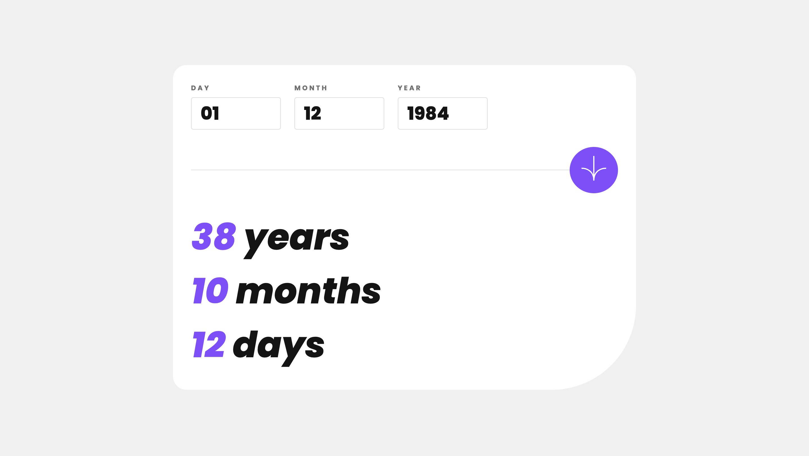

## Usage

```bash
$ npm install # or pnpm install or yarn install
```

### Learn more on the [Solid Website](https://solidjs.com) and come chat with us on our [Discord](https://discord.com/invite/solidjs)

## Available Scripts

In the project directory, you can run:

### `npm run dev`

Runs the app in the development mode.<br>
Open [http://localhost:5173](http://localhost:5173) to view it in the browser.

### `npm run build`

Builds the app for production to the `dist` folder.<br>
It correctly bundles Solid in production mode and optimizes the build for the best performance.

The build is minified and the filenames include the hashes.<br>
Your app is ready to be deployed!

## Deployment

Learn more about deploying your application with the [documentations](https://vitejs.dev/guide/static-deploy.html)

# Age Calculator

This is a solution to the [Age calculator app challenge on Frontend Mentor](https://www.frontendmentor.io/challenges/age-calculator-app-dF9DFFpj-Q).

## Table of contents

- [Overview](#overview)
    - [The challenge](#the-challenge)
    - [Screenshots](#screenshots)
- [My process](#my-process)
    - [Built with](#built-with)

## Overview

### The challenge

Users should be able to:

- View an age in years, months, and days after submitting a valid date through the form
- Receive validation errors if:
  - Any field is empty when the form is submitted
  - The day number is not between 1-31
  - The month number is not between 1-12
  - The year is in the future
  - The date is invalid e.g. 31/04/1991 (there are 30 days in April)
- View the optimal layout for the interface depending on their device's screen size
- See hover and focus states for all interactive elements on the page
- **Bonus**: See the age numbers animate to their final number when the form is submitted


### Screenshots




## My process

### Built with

- [Bun](https://bun.sh/) - JavaScript runtime & toolkit
- [Typescript](https://www.typescriptlang.org/) - Main language
- [Solid.js](https://www.solidjs.com/) - JS/TS library
- [SCSS/Sass](https://sass-scss.ru/) - CSS Preprocessors
- [React Beautiful DND](https://github.com/atlassian/react-beautiful-dnd) - Dnd library
- [React Transition Group](https://github.com/reactjs/react-transition-group) - Animation library
- [ESLint](https://eslint.org/) - Linter
